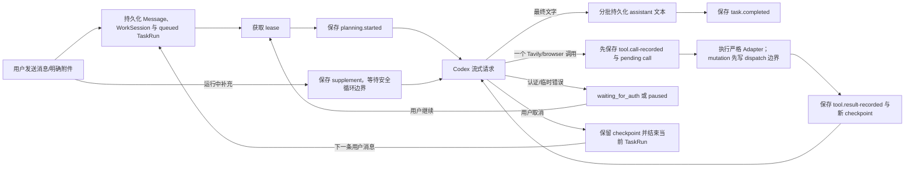

# ChatBrowserX 架构

当前架构负责可靠的 Codex 文本/图片对话、可中断恢复的 WorkSession、有界 Tavily 搜索，
以及基于严格 browser tools 的标签页控制、页面观察、可视动作、截图与网络分析。页面脚本
不能直接调用 Provider、Tavily 或任意 CDP 命令。

## 模块所有权

| 目录                  | 职责                                                    |
| --------------------- | ------------------------------------------------------- |
| `src/entries`         | Manifest 入口、Service Worker 与依赖装配                |
| `src/side-panel`      | React Side Panel、轮询客户端、对话与设置 UI             |
| `src/page`            | 用户主动触发的截图选区与选中文本 UI                     |
| `src/tasks`           | 简化任务状态、协调、恢复、面板查询与截图/选区控制       |
| `src/agent`           | 对话上下文、流持久化、严格工具 Planner 与顺序 TaskExecutor |
| `src/browser`         | 标签页、CDP/OOPIF 会话、观察、元素 ref、动作和网络采集   |
| `src/providers`       | Provider-neutral 接口、固定 Codex 与 Tavily Adapter     |
| `src/attachments`     | 图片校验、Blob 服务、截图裁剪与 Object URL 生命周期     |
| `src/persistence`     | IndexedDB、`chrome.storage.local` 与凭据边界            |
| `src/platform/chrome` | Chrome API Adapter 与版本化消息路由                     |
| `src/shared`          | ID、时间、i18n 与协议类型                               |

## 请求与恢复

任务状态只包含 `queued`、`planning`、`waiting_for_auth`、`paused`、`completed`、`failed` 和 `cancelled`。WorkSession 是一次逻辑工作的稳定边界，可以包含多个 TaskRun：暂停/继续复用当前 TaskRun；取消会结束当前 TaskRun，而之后的任意新输入会在同一 WorkSession 创建新的 TaskRun。只有任务完成才结束这段连续工作。

Checkpoint 以 provider-neutral 的顺序保存消息引用、function call/output、已完成工具结果和
pending tool call。Service Worker 重启后，仅 `queued` 与 `planning` 会自动恢复；已记录但未
执行的 pending tool 先执行，已写入的工具结果作为 function-call output 回放，不会再次请求。
Browser mutation 在 dispatch 前改为 `may_have_dispatched`；如果 worker 在动作返回前中断，
恢复只记录 `AMBIGUOUS_MUTATION` 并要求重新观察页面，不会猜测性重放副作用。

运行中的补充复用消息和附件存储，但以 `kind: 'supplement'` 与普通聊天气泡隔离。补充不会中断当前模型或工具请求，而是在下一个安全 Agent Loop 边界按持久化顺序进入 checkpoint。完成事务会拒绝遗漏任何已接受补充，因此补充与最终文字竞态时会继续同一个回答气泡，而不会静默丢失信息。旧数据库中的浏览器动作状态会在读取时归一为 `paused`，旧 pending action 不会复活或执行。

## Provider 边界

`ModelProvider`、`ModelToolDefinition`、function call/output 和工具流事件属于通用扩展接口。
`CodexAgentPlanner` 始终注册一组严格的 browser tools；只有 Tavily Key 非空时才在
每次模型请求前动态加入 `tavily_search`、`tavily_extract`、`tavily_crawl`。Planner 只能获得
“是否配置”的布尔值，不能读取 Key。并行工具调用关闭；一个模型回合只能产生一个工具调用
或最终文字。未知、多工具、参数无效以及文字与工具混合响应都会失败。

`instructions` 由固定 browser 安全说明与设置中的自定义提示组成。普通聊天 `input` 由最多
50 条已成功完成 WorkSession 的最近历史，以及当前 WorkSession checkpoint 的完整有序连续
状态组成。页面数据不会自动附加；只有模型选择 browser tool 后，其有界结果才作为
function-call output 进入下一轮。Browser screenshot 在 checkpoint 中只保存 attachment ID，
组装 Provider 请求时才从 Blob 临时还原为 `input_image`。

Tavily Adapter 只访问官方固定 `/search`、`/extract`、`/crawl` HTTPS 端点。它在执行边界再次校验参数，响应体最多 2 MiB，单项内容最多 12,000 字符、单次总内容最多 40,000 字符。Key 只从可信凭据存储即时读取并放入 Bearer Header，不进入请求体、日志或 checkpoint。

## Browser runtime

`TargetSessionRegistry` 对每个 tab 单飞 attach CDP 1.3，并通过 flattened auto-attach 管理当前
和未来的 OOPIF。模型看不到 CDP 方法；它只能调用已审核 browser schema。内容观察优先使用
Accessibility tree 与 backend node ID，同源 DOM/Shadow DOM 用于清理正文和补齐 accessible
name，跨域 iframe 通过 child target session 读取。每次 interactive snapshot 生成按 tab 与
generation 隔离的 opaque ref，旧 ref、跨 tab ref 和歧义 target 都会拒绝并提示重新观察。

动作由 `BrowserActionExecutor` 映射到固定 CDP 命令。点击、悬停和拖拽会在页面隔离世界显示
pointer-events:none 的虚拟鼠标、涟漪或轨迹；视觉反馈失败不会重复动作。坐标动作必须位于
当前 viewport，并要求模型先获取截图。截图会先隐藏扩展 overlay，经 `Page.captureScreenshot`
得到有界 PNG 后存为 Blob，再恢复 overlay。

`NetworkCaptureRegistry` 只在显式 start 后记录未来流量，每 tab 最多 500 条元数据。初始加载
分析必须显式执行 start → reload → network_idle → list。list 可按时间返回，也可按 method、
origin、path 和 query 参数名稳定采样重复端点。get 一次读取最多 5 个 opaque ID，请求体与
响应体分别按项选择且只在需要时从 CDP 临时获取；默认不读取正文。返回前会脱敏敏感 header、
query、JSON 和表单字段，并限制单体与整批大小。stop 可随时释放采集缓存；需要完整分析证据时
建议先 list，并对相关 ID 执行 get。

Content script 负责安装 ping、正文/DOM fallback、虚拟指针、overlay 显隐、截图选区、图片
预览和选中文本气泡。所有页面返回都经过版本协议和 Zod/边界校验，页面内容始终作为不可信
数据处理。

## UI 同步

Side Panel 周期读取经过 Zod 校验的完整快照。普通快照只包含 Codex Token 和 Tavily Key
是否已配置；进入设置页时才显式读取值。任务卡展示真实状态、持久化事件、运行中补充和
当前回答对应的工具结果。Browser tool 使用中/英/日紧凑标签，参数、正文、网络详情和截图
只在对应结果展开后显示；截图复用整页图片预览。补充的文字、时间和图片仅显示在所属回答
的执行详情中，不生成用户气泡。
