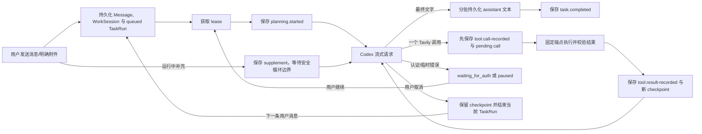

# ChatBrowserX 架构

当前架构负责可靠的 Codex 文本/图片对话、可中断恢复的 WorkSession，以及有界的 Tavily 搜索、提取和站内抓取。浏览器观察与动作工具仍未注册，页面脚本不能直接调用 Tavily。

## 模块所有权

| 目录                  | 职责                                                    |
| --------------------- | ------------------------------------------------------- |
| `src/entries`         | Manifest 入口、Service Worker 与依赖装配                |
| `src/side-panel`      | React Side Panel、轮询客户端、对话与设置 UI             |
| `src/page`            | 用户主动触发的截图选区与选中文本 UI                     |
| `src/tasks`           | 简化任务状态、协调、恢复、面板查询与截图/选区控制       |
| `src/agent`           | 对话上下文、流持久化、严格工具 Planner 与顺序 TaskExecutor |
| `src/providers`       | Provider-neutral 接口、固定 Codex 与 Tavily Adapter     |
| `src/attachments`     | 图片校验、Blob 服务、截图裁剪与 Object URL 生命周期     |
| `src/persistence`     | IndexedDB、`chrome.storage.local` 与凭据边界            |
| `src/platform/chrome` | Chrome API Adapter 与版本化消息路由                     |
| `src/shared`          | ID、时间、i18n 与协议类型                               |

## 请求与恢复

任务状态只包含 `queued`、`planning`、`waiting_for_auth`、`paused`、`completed`、`failed` 和 `cancelled`。WorkSession 是一次逻辑工作的稳定边界，可以包含多个 TaskRun：暂停/继续复用当前 TaskRun；取消会结束当前 TaskRun，而之后的任意新输入会在同一 WorkSession 创建新的 TaskRun。只有任务完成才结束这段连续工作。

Checkpoint 以 provider-neutral 的顺序保存消息引用、function call/output、已完成工具结果和 pending tool call。`tool.call-recorded`、`tool.result-recorded` 与 `task.supplements-applied` 都保持 `planning`。Service Worker 重启后，仅 `queued` 与 `planning` 会自动恢复；已记录但未执行的 pending tool 先执行，已写入的 Tavily 结果作为 function-call output 回放，不会再次请求。

运行中的补充复用消息和附件存储，但以 `kind: 'supplement'` 与普通聊天气泡隔离。补充不会中断当前模型或工具请求，而是在下一个安全 Agent Loop 边界按持久化顺序进入 checkpoint。完成事务会拒绝遗漏任何已接受补充，因此补充与最终文字竞态时会继续同一个回答气泡，而不会静默丢失信息。旧数据库中的浏览器动作状态会在读取时归一为 `paused`，旧 pending action 不会复活或执行。

## Provider 边界

`ModelProvider`、`ModelToolDefinition`、function call/output 和工具流事件属于通用扩展接口。当前 `CodexAgentPlanner` 只注册 `tavily_search`、`tavily_extract`、`tavily_crawl`，并关闭并行工具调用；一个模型回合只能产生一个工具调用或最终文字。工具名符合 `^[a-zA-Z0-9_-]+$`，未知、多工具、参数无效以及文字与工具混合响应都会失败。

`instructions` 严格使用设置值。普通聊天 `input` 由最多 50 条来自已成功完成 WorkSession 的最近历史，以及当前 WorkSession checkpoint 的完整有序连续状态组成。活动 WorkSession 中的初始输入、取消后的新输入、运行中补充、明确引用的图片和工具 call/output 不计入这 50 条历史上限；已失败或取消且未完成的其他 WorkSession 不作为普通历史发送。不读取当前页面，也不加入预算或内部策略。流文本按有界批次写入 IndexedDB；工具回合不创建空助手消息，中断的 streaming 消息先标记为 interrupted，再复用同一个回答消息启动替代请求。

Tavily Adapter 只访问官方固定 `/search`、`/extract`、`/crawl` HTTPS 端点。它在执行边界再次校验参数，响应体最多 2 MiB，单项内容最多 12,000 字符、单次总内容最多 40,000 字符。Key 只从可信凭据存储即时读取并放入 Bearer Header，不进入请求体、日志或 checkpoint。

## 页面能力

Content script 只提供：安装 ping、区域截图 overlay 显隐、截图选区，以及选中文本气泡。它不接受页面观察或 DOM 动作命令。视口/区域截图只有在用户触发并发送草稿后才进入模型输入。

## UI 同步

Side Panel 周期读取经过 Zod 校验的完整快照。普通快照只包含 Codex Token 和 Tavily Key 是否已配置；进入设置页时才显式读取值。任务卡只展示真实状态、持久化事件、运行中补充和当前回答对应的工具结果，不展示浏览器动作计数或预算总进度。补充的文字、时间和图片仅显示在所属回答的执行详情中，不生成用户气泡。
