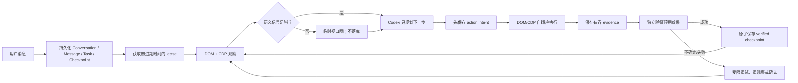

# ChatBrowserX 架构

- 文档类型：维护者架构说明
- 适用范围：当前从零重写实现
- 约束级别：实现说明；规范冲突时以 `docs/superpowers/specs/browser-agent-project-spec.md` 为准
- 日期：2026-08-15

## 模块所有权

| 目录                  | 职责                                                |
| --------------------- | --------------------------------------------------- |
| `src/entries`         | Manifest 入口、Service Worker 和依赖装配            |
| `src/side-panel`      | 原生 Side Panel 的 React UI、轮询客户端和交互状态   |
| `src/page`            | 隔离的截图选择层、选中文本气泡、操作反馈与页面命令  |
| `src/tasks`           | 任务状态、命令、协调、恢复、面板查询和截图/选区控制 |
| `src/agent`           | 上下文、工具 schema、规划、重试、风险与可恢复执行器 |
| `src/browser`         | 语义观察、目标解析、DOM/CDP 驱动、路由和验证        |
| `src/providers`       | 固定 Codex Adapter 与 Tavily Adapter                |
| `src/attachments`     | 图片策略、Blob 服务、截图裁剪和 Object URL 生命周期 |
| `src/persistence`     | IndexedDB、`chrome.storage.local` 与凭据边界        |
| `src/platform/chrome` | Chrome API Adapter、Debugger 会话和运行时消息路由   |
| `src/shared`          | ID、时间、i18n 和版本化协议类型                     |

React 只存在于 `side-panel` 与 `page`；Provider 不依赖 DOM/Chrome；页面 content script 不读取凭据或任务仓库；状态转换不写在 UI 中。

## 执行与恢复

Runner 的内存只负责当前 AbortController。持久化真相在 IndexedDB：`TaskRun` 指向最新 `Checkpoint`，`TaskEvent` 追加记录边界，`PendingActionCheckpoint` 保存动作、摘要、尝试次数、效果状态、证据和确认。

普通唤醒来源包括 Side Panel 连接、周期 alarm、标签页事件和 Chrome 启动。只有 `queued`、`observing`、`planning`、`acting`、`verifying`、`checkpointed` 且 lease 已过期/不存在的任务会自动接管。`waiting_for_tab`、`waiting_for_auth`、`waiting_for_confirmation` 和 `paused` 必须满足对应用户条件。

## 浏览器成功率策略

每次观察会尽可能同时获取：

- 顶层及可访问同源 frame 的语义 DOM；
- Accessibility tree、DOM snapshot 和扁平化 OOPIF 子会话；
- 可见/遮挡状态、稳定属性、frame/shadow 路径与当前快照内的 CDP 节点引用。

动作前重新解析结构化目标，不把 CSS selector、XPath、坐标或临时节点 ID 当作跨检查点身份。Driver Router 根据动作能力和同 origin 的已验证历史选择 DOM 或 CDP；拖拽起点或终点只要位于 CDP 子会话就强制使用 CDP。场景先验与真实结果从第一个样本起在线融合，因此一次明确失败后的下一次低风险重试即可探索另一条可用路径。只有独立 Verifier 满足预期条件才记成功样本；`waitFor` 使用动作自身的受限超时。若 Chrome 外部断开 debugger，下一次观察会重新获取会话，而不会被旧的内存所有权缓存阻止。

当观察中没有可见交互元素且可读正文不足 200 字符时，系统尝试获取一次当前活动视口图。该图限制为 6 MiB 的 PNG/JPEG/WebP，只进入当前 Provider 请求，不写入附件或任务记录；捕获失败不影响语义路径。

## Provider 与数据边界

Codex URL、模型与协议固定在 `src/providers/codex`；设置页不能改变 Base URL 或 Provider。Tavily 只有三个固定 endpoint。请求错误只映射为有限错误码，HTTP 错误正文最多读取 8 KiB 后丢弃。

用户图片和手动截图保存为 IndexedDB Blob，消息只保存 ID。模型上下文只取最近完整消息、受限工具结果、受限页面观察以及当前消息引用的合规图片。流式文本按最多 1 秒或累计 8 KiB 批量写入。

## UI 同步

Side Panel 每 750 ms 请求一个经过 Zod 校验的完整快照。轮询避免依赖易随 Service Worker 消失的长连接；过期响应通过 generation 丢弃。快照不包含 Blob 字节、Access Token 或 Tavily Key，只包含凭据是否存在。

每个对话最多存在一个未终止任务，后台在写入新消息前再次验证该约束，UI 同时锁定发送入口。选中文本 Ask AI 遇到忙碌会话时创建同标签页的新对话，避免覆盖暂停、待授权或待确认任务的恢复入口。

选中文本、截图与 Agent 操作反馈 overlay 使用 closed Shadow Root，统一登记到 overlay registry。浏览器截图前临时隐藏所有扩展 overlay，并在失败路径中恢复。操作反馈层保持 `pointer-events: none`，只显示瞬态虚拟光标、点击水波纹和拖拽过程。

DOM 点击、勾选、悬停和拖拽使用当前元素矩形，并将同源 frame 坐标逐层投影到顶层视口后通知页面反馈层；根 CDP session 复用实际 `dispatchMouseEvent` 坐标，经 `page.actionFeedback` 消息通知顶层页面。反馈发送或渲染失败不会改变动作 evidence 和验证。尚无确定顶层坐标投影的 CDP 子 session 跳过反馈，真实输入仍正常执行。

## 协议

所有消息包含 `version`、`requestId`、可判别 `type` 和严格 payload。当前扩展协议覆盖连接/面板快照、聊天、会话清理、设置、任务命令、截图、页面功能安装和选中文本；页面命令只覆盖 ping、观察、截图选择、overlay 显隐、有限坐标的 `page.actionFeedback` 和严格的结构化 DOM 动作。额外字段会被拒绝。
