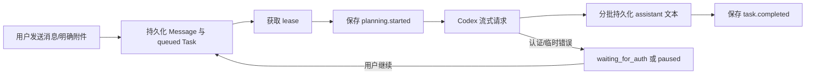

# ChatBrowserX 架构

当前架构只负责可靠的 Codex 文本/图片对话。浏览器与搜索工具的具体 schema、注册器、解析器、执行器和 UI 状态均已删除。

## 模块所有权

| 目录                  | 职责                                                    |
| --------------------- | ------------------------------------------------------- |
| `src/entries`         | Manifest 入口、Service Worker 与依赖装配                |
| `src/side-panel`      | React Side Panel、轮询客户端、对话与设置 UI             |
| `src/page`            | 用户主动触发的截图选区与选中文本 UI                     |
| `src/tasks`           | 简化任务状态、协调、恢复、面板查询与截图/选区控制       |
| `src/agent`           | 当前消息上下文、流持久化、Planner 与纯模型 TaskExecutor |
| `src/providers`       | Provider-neutral 接口与固定 Codex Adapter               |
| `src/attachments`     | 图片校验、Blob 服务、截图裁剪与 Object URL 生命周期     |
| `src/persistence`     | IndexedDB、`chrome.storage.local` 与凭据边界            |
| `src/platform/chrome` | Chrome API Adapter 与版本化消息路由                     |
| `src/shared`          | ID、时间、i18n 与协议类型                               |

## 请求与恢复

任务状态只包含 `queued`、`planning`、`waiting_for_auth`、`paused`、`completed`、`failed` 和 `cancelled`。Service Worker 重启后，仅 `queued` 与 `planning` 会自动恢复。旧数据库中的浏览器动作状态会在读取时归一为 `paused`，旧 pending action 和具体工具结果不会复活或执行。

## Provider 边界

`ModelProvider`、`ModelToolDefinition`、function call/output 和工具流事件属于通用扩展接口。当前 `CodexAgentPlanner` 始终传入 `tools: []`，因此 `buildCodexRequest` 不序列化任何工具字段。若接口未来收到非空的通用工具定义，名称必须已经符合 `^[a-zA-Z0-9_-]+$`；Adapter 不维护任何产品专用工具映射。

`instructions` 严格使用设置值。普通聊天 `input` 由当前任务的用户消息和该消息明确引用的图片组成，不读取当前页面，也不加入旧消息、预算、检查点或内部策略。流文本按有界批次写入 IndexedDB；中断的 streaming 消息先标记为 interrupted，再启动替代请求。

## 页面能力

Content script 只提供：安装 ping、区域截图 overlay 显隐、截图选区，以及选中文本气泡。它不接受页面观察或 DOM 动作命令。视口/区域截图只有在用户触发并发送草稿后才进入模型输入。

## UI 同步

Side Panel 周期读取经过 Zod 校验的完整快照。普通快照只包含是否已配置 Token；进入设置页时才显式读取 Token 值。任务卡只展示真实状态和持久化事件，不展示浏览器动作计数或预算总进度。
